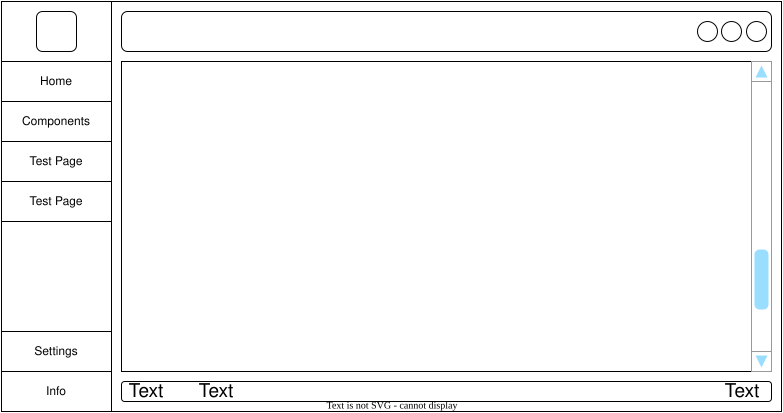

# PySmartDeskNorm: A Python PySide Boilerplate
[![Contributors][contributors-shield]][contributors-url]
[![Forks][forks-shield]][forks-url]
[![Stargazers][stars-shield]][stars-url]
[![Issues][issues-shield]][issues-url]
[![MIT License][license-shield]][license-url]
![GitHub repo size]

# Description
PySmartDeskNorm is a PySide6 Boilerplate for creating a Python based Desktop application.

# Features
 - Modern UI
 - Custom Title Bar
 - Easy to change configure setting and themes by changing json(s)

# Screenshots


# Built With
 - Python = 3.11.0 
 - PySide = 6.4.0 

# Getting Started
These instructions will get you a copy of the project up and running on your local machine for development and testing purposes.

## Installing
1. Clone this PySmartDeskNorm repository.
   ```bash
   git clone https://github.com/TecSachinGupta/PySmartDeskNorm
   ```
2. Create and activate a virtual environment.
   ```bash
   cd PySmartDeskNorm
   python -m venv .venv
   source .venv/bin/activate
   ```
3. Install the project and dev dependencies.
   ```bash
   python -m pip install --upgrade pip
   pip install -e '.[dev]'
   ```
4. Run the app from the project root.
   ```bash
   python -B src/app.py
   ```

## Structure
```
.
│   
├─── src
│    ├─── configs
│    ├─── constants
│    ├─── controllers
│    ├─── models
│    ├─── resources
│    ├─── services
│    ├─── utils
│    └─── views
│         ├─── components
│         ├─── containers
│         ├─── pages
│         └─── widgets
└─── test 
```

## Process Flow




## Components
 ![IN-PROGRESS]  ![NEEDTESTING]  ![COMPLETED]  ![OUTDATED]  ![FUTUREWORK] 

|Status        |Name                 |Location                |Description                                                             |
|:------------:|---------------------|------------------------|------------------------------------------------------------------------|
|![IN-PROGRESS]|AnimatedToggle       |views.components        |Custom Animated Toggle button using the Checkbox widget and animation.  |
|![IN-PROGRESS]|Button               |views.components        |Custom button using the Push button.  |
|![IN-PROGRESS]|Column               |views.components        |Class having the vertical layout to place content.  |
|![IN-PROGRESS]|Div                  |views.components        |Genric wrapper class to provide the background.  |
|![IN-PROGRESS]|Row                  |views.components        |Class having the horizontal layout to place content.  |


# Credits
 - [PyOneDark](https://github.com/Wanderson-Magalhaes/PyOneDark_Qt_Widgets_Modern_GUI/) by WANDERSON M.PIMENTA: Repository for QT Modern UI.
 - [Animating custom widgets with QPropertyAnimation](https://www.pythonguis.com/tutorials/pyside6-animated-widgets/) by Salem Al Bream: Blog on creting the Animated Toggle Button


[IN-PROGRESS]: https://img.shields.io/badge/-In--Progress-yellow?style=flat-square
[NEEDTESTING]: https://img.shields.io/badge/-Needs%20Testing-green?style=flat-square
[COMPLETED]: https://img.shields.io/badge/-Completed-brightgreen?style=flat-square
[OUTDATED]: https://img.shields.io/badge/-Outdated-red?style=flat-square
[FUTUREWORK]: https://img.shields.io/badge/-Future--Work-blue?style=flat-square

[contributors-shield]: https://img.shields.io/github/contributors/TecSachinGupta/PySmartDeskNorm.svg?style=for-the-badge
[contributors-url]: https://github.com/TecSachinGupta/PySmartDeskNorm/graphs/contributors
[forks-shield]: https://img.shields.io/github/forks/TecSachinGupta/PySmartDeskNorm.svg?style=for-the-badge
[forks-url]: https://github.com/TecSachinGupta/PySmartDeskNorm/network/members
[stars-shield]: https://img.shields.io/github/stars/TecSachinGupta/PySmartDeskNorm.svg?style=for-the-badge
[stars-url]: https://github.com/TecSachinGupta/PySmartDeskNorm/stargazers
[issues-shield]: https://img.shields.io/github/issues/TecSachinGupta/PySmartDeskNorm.svg?style=for-the-badge
[issues-url]: https://github.com/TecSachinGupta/PySmartDeskNorm/issues
[license-shield]: https://img.shields.io/github/license/TecSachinGupta/PySmartDeskNorm.svg?style=for-the-badge
[license-url]: https://github.com/TecSachinGupta/PySmartDeskNorm/blob/master/LICENSE
[GitHub repo size]: https://img.shields.io/github/repo-size/TecSachinGupta/PySmartDeskNorm?style=for-the-badge